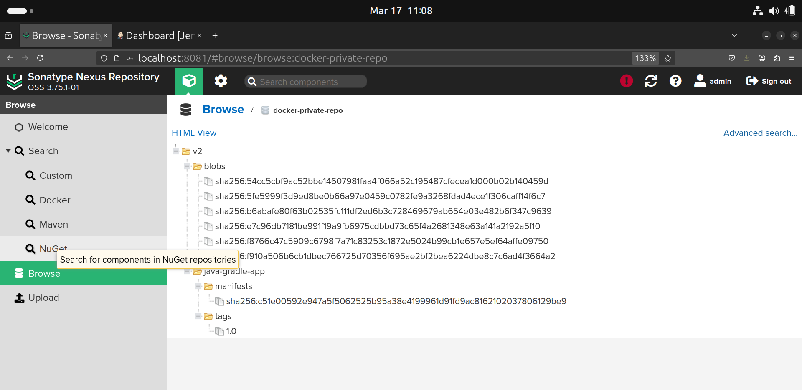

# Java Gradle Project

This project is a simple Spring Boot web application built using Gradle. It demonstrates how to compile a Java application and publish the generated JAR artifact to a Maven repository (Nexus) using the Maven Publishing plugin.

## Table of Contents

- [Overview](#overview)
- [Features](#features)
- [Prerequisites](#prerequisites)
- [Getting Started](#getting-started)
- [Build and Run](#build-and-run)
- [Publishing the Artifact](#publishing-the-artifact)
- [Gradle Configuration Details](#gradle-configuration-details)
- [Troubleshooting](#troubleshooting)
- [Docker Integration (Part-2)](#docker-integration-part-2)
- [CI/CD Pipeline (Part-3)](#cicd-pipeline-part-3)

## Overview

This Java project leverages Spring Boot to build a web application. In addition to running the application, it includes a custom Gradle configuration for publishing the JAR artifact to a Nexus repository. The project demonstrates:
- Publishing configuration, including secure credential handling via `gradle.properties`.
- Allowing an insecure (HTTP) protocol in a controlled environment for personal projects.

## Features

- **Maven Publishing:** Configured to publish snapshots to a Nexus repository.
- **Gradle Build Automation:** Automated build and publish processes.

## Prerequisites

- **Java Development Kit (JDK):** Ensure you have JDK 17 (or higher) installed.
- **Gradle Wrapper:** The project includes a Gradle wrapper, so you don’t need a separate Gradle installation.
- **Nexus Repository:** A Nexus instance (or any Maven repository) running at `http://localhost:8081/repository/maven-snapshots/` (update the URL as needed).

## Getting Started

1. **Clone the Repository:**
   ```sh
   git clone <repository-url>
   cd java-gradle-project
   ```

2. **Configure Repository Credentials:**
   Create or update the `gradle.properties` file in the project root with the following properties:
   ```properties
   repoUser=your-username
   repoPassword=your-password
   ```

## Build and Run

Build the project using the Gradle wrapper:
```sh
./gradlew build
```

Run the Spring Boot application:
```sh
./gradlew bootRun
```
The compiled JAR file can be found in the `build/libs/` directory.

## Publishing the Artifact

1. **Ensure your Nexus repository is running.**
2. **Publish the Artifact:**
   ```sh
   ./gradlew publish
   ```
This command will publish the artifact named `java-gradle-project-1.0-SNAPSHOT.jar` to the configured Nexus repository.

### Note on Insecure Protocol

The Nexus repository URL uses HTTP (`http://localhost:8081`), which is an insecure protocol. To allow this in your Gradle configuration:
```groovy
allowInsecureProtocol = true
```

## Gradle Configuration Details

- **Plugins Used:**
  - `maven-publish` - Publishes artifacts to a Maven repository.

- **Artifact Configuration:**
  ```groovy
  artifact(file("build/libs/java-gradle-project-${version}.jar")) {
      extension = 'jar'
  }
  ```

## Troubleshooting

- **Error: "No such property: jar for class: java.lang.String"**  
  Ensure the string interpolation is correctly formatted:
  ```groovy
  "build/libs/java-gradle-project-${version}.jar"
  ```

- **Insecure Protocol Issues:**  
  Set `allowInsecureProtocol = true` in the Gradle configuration.

## Proof of Nexus Repository

Below is a screenshot showing the Nexus repository after a successful publish:


## Docker Integration (Part-2)

This section expands the project by creating a Docker image and pushing it to the Nexus Repository Manager using the previously generated `.jar` file.

### 1. Docker Login to Nexus Repository

Authenticate with the private Nexus Docker registry:
```sh
docker login <nexus-server-ip>:<docker-repository-port>
```
Replace `<nexus-server-ip>` and `<docker-repository-port>` with the Nexus server details (Docker repository port, not the UI port). You will be prompted for your Nexus username and password.

### 2. Docker Authentication and Config.json

Upon successful login, Docker stores an authentication token in:
- **Linux/macOS:** `~/.docker/config.json`

### 3. Pushing a Docker Image to Nexus

#### Build a Docker Image:
```sh
docker build -t <image-name>:<tag> .
```

#### Tag the Image for Nexus Registry:
```sh
docker tag <local-image-name>:<local-tag> <nexus-registry-endpoint>/<image-name>:<tag>
```

#### Push the Retagged Image to Nexus:
```sh
docker push <nexus-registry-endpoint>/<image-name>:<tag>
```

### 4. Verifying the Pushed Image in Nexus UI

After pushing, verify the image in your Nexus Docker Hosted repository via the Nexus UI.

### 5. Retrieving Docker Image Information using Nexus API

Retrieve information about the pushed images using the Nexus REST API:
```sh
curl -u <nexus-username>:<nexus-password> -X GET 'http://<nexus-server-ip>:8081/service/rest/v1/components?repository=<docker-repository-name>'
```
Replace placeholders with your Nexus credentials and repository details.

### 6. Proof of Nexus Docker Image

Below is a screenshot showing the uploaded Docker image in Nexus:


## CI/CD Pipeline (Part-3)

This section outlines the CI/CD process for the project. The Jenkins pipeline loads an external script (`script.groovy`) which defines methods for building the JAR, creating a Docker image, and deploying the application. This modular approach simplifies maintenance and allows the CI/CD steps to be updated independently.

The pipeline includes the following stages:
- **Init:** Loads the external script to initialize variables and methods.
- **Build Jar:** Compiles the project and creates the JAR file.
- **Build Docker Image:** Uses the JAR to build a Docker image.
- **Deploy:** Deploys the application based on the defined deployment strategy.

Additionally, the pipeline automates the upload of the Docker image to a private Docker Hub repository. Below is a screenshot showing proof of the Docker image upload from the CI/CD pipeline:


